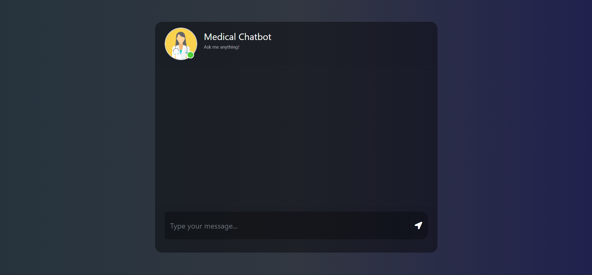
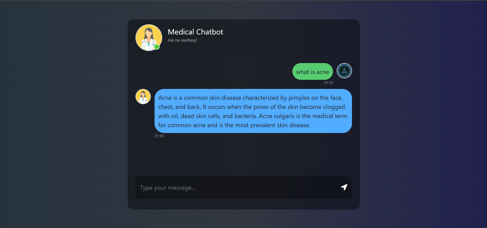
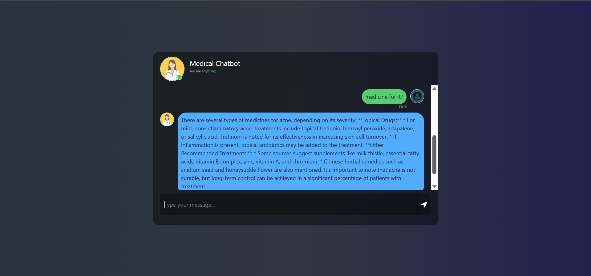
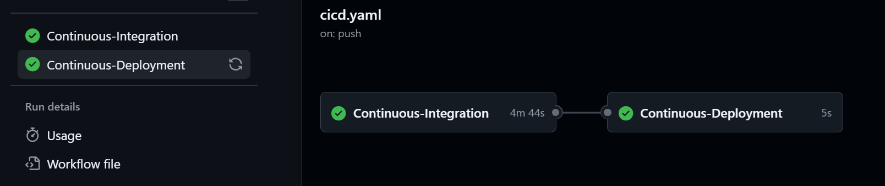

# End-to-End DevOps Deployment of an AI-Powered Medical Chatbot on AWS

<p align="center">
  
  
  
  
  
  
  
  
</p>

---

# Project Overview

This project is an **AI-powered Medical Chatbot** built using **Retrieval-Augmented Generation (RAG)** architecture. The chatbot answers medical-related queries by retrieving relevant information from medical documents stored as vector embeddings in **Pinecone** and generating contextual responses using **Google Gemini LLM**.

The application was fully containerized using **Docker** and deployed on **AWS EC2** with automated **CI/CD pipelines** using **GitHub Actions** and **Amazon ECR**.

This project demonstrates practical implementation of:

* Generative AI
* Retrieval-Augmented Generation (RAG)
* LangChain pipelines
* Vector databases
* Docker containerization
* CI/CD automation
* AWS cloud deployment
* DevOps workflows
* Production debugging

---

# Features

* AI-powered medical question answering
* Retrieval-Augmented Generation (RAG)
* Vector similarity search using Pinecone
* Google Gemini LLM integration
* PDF document processing pipeline
* Dockerized application
* AWS EC2 deployment
* Automated CI/CD using GitHub Actions
* Self-hosted GitHub Runner deployment
* Production-style cloud deployment workflow

---

# System Architecture

```text
                    ┌──────────────────────┐
                    │      User Query      │
                    └──────────┬───────────┘
                               │
                               ▼
                    ┌──────────────────────┐
                    │    Flask Web App     │
                    └──────────┬───────────┘
                               │
                               ▼
                    ┌──────────────────────┐
                    │  LangChain Retriever │
                    └──────────┬───────────┘
                               │
                               ▼
                    ┌──────────────────────┐
                    │ Pinecone Vector DB   │
                    └──────────┬───────────┘
                               │
                               ▼
                    ┌──────────────────────┐
                    │ Gemini LLM Response  │
                    └──────────┬───────────┘
                               │
                               ▼
                    ┌──────────────────────┐
                    │  Final AI Response   │
                    └──────────────────────┘
```

---

# Retrieval-Augmented Generation (RAG)

The chatbot uses a **RAG pipeline** to provide context-aware and domain-specific answers.

Instead of relying only on the LLM’s pretrained knowledge, the system:

1. Retrieves relevant medical document chunks
2. Uses vector similarity search in Pinecone
3. Passes retrieved context to Gemini
4. Generates accurate medical responses

This significantly improves:

* Response quality
* Context awareness
* Factual grounding
* Domain relevance

---

# Tech Stack

## Backend

* Python
* Flask
* LangChain

## AI / LLM

* Google Gemini API
* Hugging Face Embeddings
* RAG Architecture

## Vector Database

* Pinecone

## DevOps & Cloud

* Docker
* AWS EC2
* Amazon ECR
* GitHub Actions
* Self-hosted GitHub Runner

## Utilities

* Conda
* Git
* Ubuntu Linux

---

# Project Structure

```bash
Medical-Chatbot-DevOps-Deployment/
│
├── data/
│   └── medical_book.pdf
│
├── src/
│   ├── helper.py
│   └── prompt.py
│
├── templates/
│   └── chat.html
│
├── static/
│   └── style.css
│
├── app.py
├── store_index.py
├── requirements.txt
├── Dockerfile
├── .env
├── .gitignore
│
└── .github/
    └── workflows/
        └── cicd.yaml
```

---

# Document Processing Pipeline

## Step 1: PDF Loading

Medical documents are loaded using LangChain document loaders.

The dataset contains:

* Diseases
* Symptoms
* Treatments
* Medical terminology
* Healthcare-related knowledge

---

## Step 2: Text Chunking

Large medical documents are divided into smaller chunks.

Benefits:

* Efficient retrieval
* Better semantic search
* Improved embedding quality
* Reduced token usage

---

## Step 3: Embedding Generation

Embeddings are generated using Hugging Face sentence transformers:

```python
sentence-transformers/all-MiniLM-L6-v2
```

These embeddings convert text into high-dimensional vectors representing semantic meaning.

---

## Step 4: Pinecone Vector Database

The embeddings are stored in Pinecone.

Pinecone enables:

* Fast vector similarity search
* Scalable embedding storage
* Efficient semantic retrieval

---

# Gemini LLM Integration

Initially, the project used OpenAI GPT-4o.

Later, the system was migrated to **Google Gemini** for:

* Lower API costs
* Faster responses
* Better free-tier availability

Final implementation:

```python
from langchain_google_genai import ChatGoogleGenerativeAI

chatModel = ChatGoogleGenerativeAI(
    model="models/gemini-2.5-flash-lite",
    google_api_key=GEMINI_API_KEY,
    temperature=0.3
)
```

---

# LangChain Workflow

## Retriever

```python
retriever = docsearch.as_retriever(
    search_type="similarity",
    search_kwargs={"k": 3}
)
```

Retrieves the most relevant medical chunks.

---

## Prompt Template

Custom prompts were designed to:

* Keep responses concise
* Maintain medical context
* Prevent hallucinations
* Improve answer quality

---

## Question Answer Chain

```python
question_answer_chain = create_stuff_documents_chain(
    chatModel,
    prompt
)
```

---

## Retrieval Chain

```python
rag_chain = create_retrieval_chain(
    retriever,
    question_answer_chain
)
```

---

# Flask Web Application

The chatbot backend was built using Flask.

### Main Responsibilities

* Receive user messages
* Invoke LangChain RAG pipeline
* Return AI-generated responses

### API Routes

| Route  | Description              |
| ------ | ------------------------ |
| `/`    | Chatbot UI               |
| `/get` | Process chatbot messages |

---

# Docker Containerization

The application was fully containerized using Docker.

## Docker Benefits

* Environment consistency
* Simplified deployment
* Portability
* Dependency isolation
* Scalable infrastructure

## Dockerfile

```dockerfile
FROM python:3.10-slim-buster

WORKDIR /app

COPY requirements.txt .

RUN pip install --upgrade pip
RUN pip install --no-cache-dir -r requirements.txt

COPY . .

EXPOSE 8080

CMD ["python3", "app.py"]
```

---

# AWS Cloud Deployment

## AWS Services Used

| Service        | Purpose                |
| -------------- | ---------------------- |
| EC2            | Application hosting    |
| ECR            | Docker image registry  |
| IAM            | Deployment permissions |
| GitHub Actions | CI/CD automation       |

---

# EC2 Deployment

The application was deployed on an Ubuntu EC2 instance.

### Responsibilities of EC2

* Host Docker containers
* Run Flask application
* Execute self-hosted GitHub runner
* Serve chatbot application publicly

---

# Amazon ECR

Docker images are stored in Amazon Elastic Container Registry.

### Workflow

1. Build Docker image
2. Push image to ECR
3. Pull image on EC2
4. Run container automatically

---

# CI/CD Pipeline with GitHub Actions

A fully automated CI/CD pipeline was implemented.

## Continuous Integration

### Steps

* Checkout source code
* Configure AWS credentials
* Build Docker image
* Push image to ECR

---

## Continuous Deployment

### Steps

* Trigger deployment on push
* Stop old Docker container
* Pull latest image
* Run updated container on EC2

---

# Self-Hosted GitHub Runner

A self-hosted GitHub runner was configured directly on the EC2 instance.

### Benefits

* Faster deployment
* Direct infrastructure control
* Real-world CI/CD workflow

---

# Environment Variables

Sensitive credentials were managed using:

* `.env`
* GitHub Secrets

### Example Variables

```env
PINECONE_API_KEY=xxxxxxxxxx
GEMINI_API_KEY=xxxxxxxxxx
AWS_ACCESS_KEY_ID=xxxxxxxxxx
AWS_SECRET_ACCESS_KEY=xxxxxxxxxx
```

---

# Challenges Faced & Solutions

## Challenge 1: Dependency Conflicts

### Problems

* LangChain version mismatches
* Incompatible packages
* Deprecated APIs

### Solutions

* Version pinning
* Dependency cleanup
* Compatible package selection

---

## Challenge 2: Gemini API Migration

### Problems

* Authentication errors
* API quota limits
* Unsupported models

### Solutions

* Switched to supported Gemini models
* Configured environment variables correctly
* Migrated from OpenAI to Gemini APIs

---

## Challenge 3: Docker Build Failures

### Problems

* Stale Docker cache
* Missing dependencies
* Incorrect requirements configuration

### Solutions

* Used `--no-cache`
* Fixed requirements file
* Rebuilt images cleanly

---

## Challenge 4: CI/CD Deployment Issues

### Problems

* Container crashes
* Old images being reused
* Runtime dependency failures

### Solutions

* Manual container debugging
* Docker log inspection
* Clean rebuild workflows

---

## Challenge 5: ECR Authentication Issues

### Problems

* Unauthorized Docker pull attempts

### Solutions

* AWS CLI configuration
* ECR login setup
* IAM permission management

---

# Key Learning Outcomes

This project provided practical exposure to:

## AI Engineering

* LangChain pipelines
* Retrieval-Augmented Generation
* Prompt engineering
* LLM integration
* Vector search systems

## DevOps Engineering

* Docker containerization
* CI/CD automation
* GitHub Actions workflows
* Cloud deployment debugging
* Infrastructure management

## Cloud Engineering

* AWS EC2 deployment
* Amazon ECR
* Linux server management
* Deployment automation

---

# Future Improvements

Potential future enhancements:

* User authentication
* Conversation memory
* Database integration
* Kubernetes deployment
* HTTPS configuration
* Monitoring & logging
* Multi-user scalability
* Advanced UI improvements
* Fine-tuned medical LLMs

---

# Local Setup Instructions

## STEP 1 — Clone Repository

```bash
git clone https://github.com/your-username/Medical-Chatbot-DevOps-Deployment.git
cd Medical-Chatbot-DevOps-Deployment
```

---

## STEP 2 — Create Conda Environment

```bash
conda create -n medibot python=3.10 -y
conda activate medibot
```

---

## STEP 3 — Install Dependencies

```bash
pip install -r requirements.txt
```

---

## STEP 4 — Create .env File

```env
PINECONE_API_KEY=xxxxxxxxxx
GEMINI_API_KEY=xxxxxxxxxx
```

---

## STEP 5 — Store Embeddings in Pinecone

```bash
python store_index.py
```

---

## STEP 6 — Run Flask Application

```bash
python app.py
```

---

# Docker Commands

## Build Docker Image

```bash
docker build -t medical-chatbot .
```

## Run Container

```bash
docker run -p 8080:8080 medical-chatbot
```

---

# Project Demonstration

## Chatbot Interface

<p align="center">  </p>
<p align="center">  </p>
<p align="center">  </p>

---

## GitHub Actions Pipeline

<p align="center">  </p>

---

